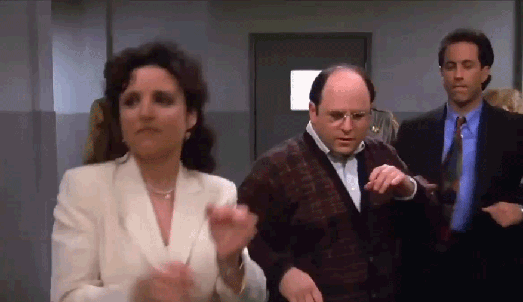

# TVSeries-Script-Generator

In this project, we generate new [Seinfeld](https://en.wikipedia.org/wiki/Seinfeld) TV scripts using RNNs.  We use a part of the [Seinfeld dataset](https://www.kaggle.com/thec03u5/seinfeld-chronicles#scripts.csv) of scripts from 9 seasons.  The Neural Network we have built generates a new ,"fake" TV script, based on patterns it recognizes in this training data.

In practice, we can train the network with **any** TV series scripts and generate new scripts.

